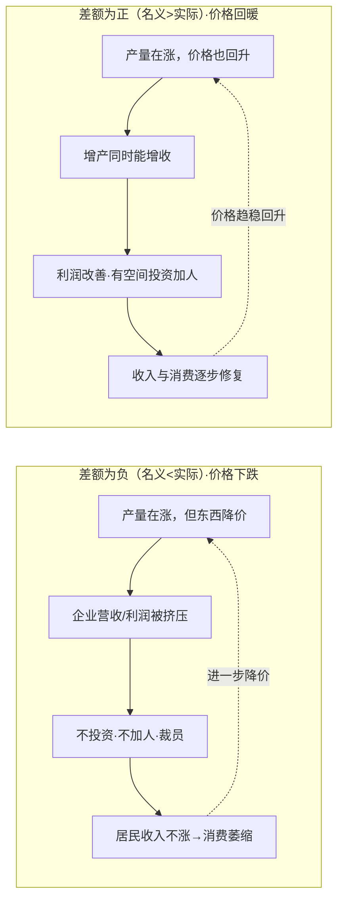
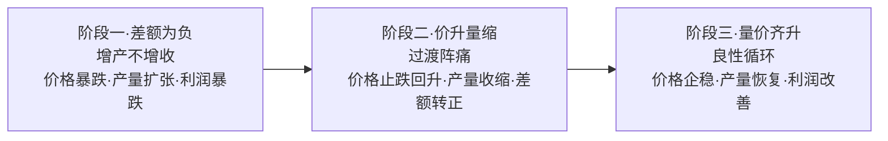

作为普通人，对于国家的政治局会议有什么必须要了解的理由么？一来我可能也不从政，也没有相关知识背景，拿着会议通稿看，字都认识，但字里行间表达了什么意思，根本读不出来；二来我上学、读书、工作、成家这么多年过来，我也都没有真正看过，充其量在散乱的记忆中对新闻联播里又开到了多少届几中全会有个大致模糊的印象，它对于我也只不过好像是与公元纪年不同的另一种纪年法。
可许多年过去，我体感到时代的车轮在我不长的人生轨迹上，深浅分明的压出它的车辙后，我才发现原来都曾经在某个中央的文件、会议通稿中白纸黑字的预言过。
不要站在政策制定者的角度普及宣传，要站在普通读者老百姓的角度讲关联、讲厉害、谈展望
# 26年7月政治局会议解读

## 基本信息

| 项目 | 内容 |
|------|------|
| 来源 | 诞视·趋势研习营 2606期 NO.015（上）+ NO.016（下） |
| 发布日期 | 2026-08-05 |
| 主理人 | 诞视 |
| 平台 | 小鹅通·鹅圈子 |
| 圈子ID | c_6a1507dea9053_a1aCHaTM8427 |
| 原文链接 | 上篇 [鹅圈子](https://quanzi.xiaoe-tech.com/c_6a1507dea9053_a1aCHaTM8427/feed_detail?feeds_id=d_6a72c10033c28_uKKhqiWFR9TO) ｜ 下篇 [鹅圈子](https://quanzi.xiaoe-tech.com/c_6a1507dea9053_a1aCHaTM8427/feed_detail?feeds_id=d_6a72c15227704_jGaJZ9YpArn6) |
| 主题 | 2026年7月政治局会议解读（上·宏观 + 下·产业与制度） |

## 关联

- 相关领域：[[财富认知]]
- 相关课程/专栏：[[何刚投资参考2026]]
- 同系列：[[26年4月政治局会议解读]]（NO.003，产业篇）
- 独立成篇：[[英伟达投资Marvell战略拆解]]（NO.010）

---

# 26年7月政治局会议解读

> **全年脉络的答案**：定调收敛了，逆周期回来了，增量政策从"储备"变成"谋划出台"。**观察期结束**。
> 上篇（NO.015）讲宏观和政策节奏变化，下篇（NO.016）集中看产业和制度。

## 背景知识：政治局会议与中央全会

> 读懂本次会议解读，需先分清两类会议——它们是"看政策的节奏表"。

**两类会议的本质区别**：

| | 中央政治局会议 | 中央委员会全体会议（全会） |
|---|---|---|
| 谁开 | 政治局委员（约25人） | 中央委员（200+）+候补委员 |
| 频率 | 较频繁（关键节点） | 每年至少1次，一届通常7次 |
| 定位 | 日常决策：形势研判+工作部署 | 战略性、制度性重大决策 |
| 节奏 | 短期，随数据调整 | 中长期，定方向/定制度 |

党的中央组织层级：全国代表大会（每5年，最高领导机关）→ 选举中央委员会（闭会期间领导全部工作）→ 全会选举中央政治局及其常委会、总书记（闭会期间行使中央委员会职权）。政治局会议与全会，分别是"政治局"和"中央委员会"这两个层级召开的会议。

**政治局会议的经济三次惯例**：每年 4月底、7月底、12月初 重点分析经济形势——这正是本系列解读"4月/7月/12月三次会议"的由来（4月看一季度数据、7月看上半年数据、12月衔接中央经济工作会议定调来年）。上篇"逆周期调节"4月消失、7月回归，即是政策力度随这些会议即时调整的短期节奏体现。

**中央全会一到七中的惯例**：

| 全会 | 通常时间 | 惯例主题 |
|------|---------|---------|
| 一中 | 党代会闭幕后 | 选举中央领导机构 |
| 二中 | 次年2-3月 | 向国家机构换届提建议 / 重大改革方案 |
| 三中 | 次年秋 | 改革与重大决策部署（历届最关键） |
| 四中 | 第三年秋 | 重大制度建设 / 法治 / 治理 |
| 五中 | 第四年秋 | 传统上审议下一个五年规划建议 |
| 六中 | 第五年 | 党的建设 / 重大历史决议 |
| 七中 | 党代会前 | 为下一届党代会做准备 |

**本届（二十届）的节奏变化**：按惯例五中全会审议五年规划建议（十九届五中2020年10月审了"十四五"建议）。但本届把"十五五"规划建议提前到四中全会（2025年10月）完成，规划纲要也已在2026年全国两会审议通过——规划议程前置消化后，2026年10月二十届五中全会改换为党的建设主题。这就是上篇关键背景里"五中全会换主题"的由来。

**两层节奏配合看**：政治局会议看"当下怎么走"（短期、随数据），全会看"中长期往哪走"（三中定改革、五中定规划/党建等战略议题）。下篇反内卷进入法律制度建设、六张网走向固定工程专名属全会层面的中长期制度安排；上篇措辞变化属政治局会议层面的短期节奏。两层分开看，才不会把短期波动误读成长期方向。

## 背景知识：GDP 增速的两种算法与价格差额

> 理解上篇"量缓价暖"判断的钥匙。一个经济体的变化来自两个维度：**产量**变了、**价格**也变了，所以 GDP 增速算两次。

**两种算法**：

| | 名义 GDP | 实际 GDP |
|---|---|---|
| 算法 | 当年价格 × 产量 | 基期价格 × 产量 |
| 价格因素 | 含价格变动 | 剔除价格变动 |
| 看什么 | "卖了多少钱"——企业营收/利润、名义收入 | "产了多少东西"——真实产量、跨期比较 |

**"两个数"与差额**：二季度实际增速 4.3%（剔除价格）、名义增速 5.9%（按当年价格）。**差额 = 5.9% − 4.3% = +1.6%**，这 +1.6% 就是价格回升的贡献（对应 GDP 平减指数变化）。

**差额正负的含义**：
- **为负**（名义 < 实际）：东西整体降价。产量虽涨，卖价跌得更多，名义收入跑输产量 → 通缩压力
- **为正**（名义 > 实际）：价格回升，价格正向贡献。增产同时卖价也在涨 → 暖信号

**传导路径**（企业营收利润按名义价格算，所以差额正负决定"增产能不能变成增收"）：



**文章背景**：过去三年多差额为负（通缩压力，企业营收利润格外难看）；二季度差额转正 = 价格开始正向贡献（回暖信号，对应去年12月"物价合理回升"目标）。

**回到"量缓价暖"与政策双约束**：实际增速 4.3% 放缓（量缓，需政策托增长），但差额转正（价暖，价格刚回暖）。两个信号合起来决定了政策的双约束——既要托增长，又不能大水漫灌（会冲乱刚回暖的物价预期、把差额重新打回负）。这就是上篇"发力提效"（先把已批的钱用起来而非总量大刺激）的逻辑。下篇反内卷治低价竞争，本质也是在**托住价格底部**、保护"价暖"这个刚出现的正向循环。

### 背景知识：四类财政资金与国家四本账

> 理解上篇"发力提效""存量资金落地"的前提——搞清楚这些"钱"是什么、从哪来、进哪本账。

**四类财政资金**：

| 资金 | 是什么 | 规模（2026年） | 特点 |
|------|--------|---------------|------|
| **中央预算内投资** | 中央财政预算里直接列支的投资支出 | 约7350亿（2024年基数） | 最"硬"的财政资金，直接花不用还，投向公益性/准公益性项目 |
| **专项债** | 地方政府发行的债券，还本付息靠项目收益或土地出让收入 | 约4.4万亿 | 专款专用，必须对应具体项目（基建、棚改、园区等），不能发工资或补一般支出 |
| **超长期特别国债** | 中央政府发行，期限20/30/50年 | 1.3万亿 | 超长期=还钱压力推到几十年后；特别=有特定用途（六张网、"两重"等），不进一般预算笼子混着花 |
| **新型政策性金融工具** | 国开行、进出口银行、农发行三家政策性银行的贷款/投资 | 8000亿 | 不是财政直接掏钱，而是政策性银行用低成本资金做"准财政"的事——利率低、期限长，投向城市更新、基建、科技创新等，本质是"财政撬动金融"的杠杆工具 |

**国家四本账（政府预算体系）**：

| 账本 | 全称 | 记什么 | 钱从哪来 |
|------|------|--------|---------|
| **一本账** | 一般公共预算 | 政府日常运转+一般性支出 | 税收为主（增值税、企业所得税等）+发债 |
| **二本账** | 政府性基金预算 | 特定基金收入对应支出 | 土地出让金、专项债、特别国债等 |
| **三本账** | 国有资本经营预算 | 国企利润上缴和再投入 | 国企利润上缴（规模小） |
| **四本账** | 社会保险基金预算 | 社保收支 | 社保缴费+财政补贴 |

**四类资金各进哪本账**：

| 资金 | 进哪本账 | 说明 |
|------|---------|------|
| 中央预算内投资 | 一本账（一般公共预算） | 中央财政直接列支 |
| 专项债 | 二本账（政府性基金预算） | 地方政府发行，收入和还本付息都走基金预算 |
| 超长期特别国债 | 二本账 | 专款专用，单列科目，不混入一本账一般支出 |
| 新型政策性金融工具 | **不进财政账本** | 政策性银行的表内贷款/投资，是金融而非财政资金，但有财政属性（政府背书+政策导向） |

**简单记忆**：一本账是"吃饭财政"（税收养政府），二本账是"建设财政"（卖地+发债搞建设），三本账小（国企利润），四本账专（社保）。专项债、特别国债都在二本账，政策性金融工具在银行表上不进财政账。

**回到"发力提效"**：专项债上半年发行2.07万亿（进度47%），有发行慢的问题；但更大瓶颈在"使用慢"——已发行的钱到地方账上后没及时花到项目上（项目前期工作不足、项目储备不够、化债压力下地方花钱谨慎）。"发力提效"=发行+使用两端一起加速，但核心卡点在使用端。

### 背景知识：政策高频词速查——"两重""两新""三保"

> 政策通稿里反复出现的简称，集中放一起便于对照。

**"两新"** = 大规模**设备更新** + 消费品**以旧换新**（2024年3月国务院行动方案提出），稳投资+促消费的一体两面：

| 一"新" | 什么 | 具体方向 |
|--------|------|---------|
| 大规模设备更新 | 企业/机构换老旧设备（投资端） | 工业、农业、建筑、交通、教育、医疗等领域设备更新改造 |
| 消费品以旧换新 | 老百姓交旧换新（消费端） | 汽车、家电、家装厨卫 |

- 资金支持：超长期特别国债专项额度 + 央行设备更新改造专项再贷款。
- **与"两重"的区别**：两重偏"国家战略级项目"（大基建、安全能力），两新偏"企业设备 + 居民消费"（更贴企业和个人）。

**"两重"** = 重大战略实施 + 重点领域安全能力建设（上位总框架，详见下篇"六张网"补注）。

**基层"三保"底线** = 保基本民生、保工资、保运转，是**基层政府（市县乡）财政必须守住的底线**：

| 保什么 | 含义 |
|--------|------|
| 保基本民生 | 养老金、低保、医保、助学、困难救助等兜底支出不能断 |
| 保工资 | 教师、医护、基层公务员等财政供养人员工资不能欠 |
| 保运转 | 基层机关事业单位能正常开门运转 |

- **为什么强调"底线"**：基层（尤其经济弱、土地财政依赖重的市县）财政最吃紧，一旦有缺口最先被砍的是民生和工资——最伤稳定、也最伤政府信用。
- **与7月会议关联**：在"切实筑牢安全屏障"里，化债与守牢"三保"底线并列——化解地方债风险不能以牺牲基层运转和民生为代价，两条线同时守住。

### 行业实例：光伏的三阶段演变

把上面的差额机制落到一个行业上看最清楚。光伏过去几年的走势，正好对应"差额为负 → 价升量缩 → 量价齐升"三阶段：



**阶段一·差额为负（光伏过去几年）**：产能严重过剩，组件价格从约 2 元/W 暴跌到 0.7 元/W 甚至更低。产量在涨（产能扩张+装机增长），但价格跌得更快，企业出货量创新高、利润却暴跌甚至亏损（隆基、通威等）——增产不增收，名义<实际，差额为负，通缩循环的产业缩影。

**转变一：差额为负 → 价升量缩**。两股力量同时作用：
- **价格回升**靠反内卷政策（限制低价中标、反不正当竞争、行业自律）+ 价格见底后企业不再亏本甩卖
- **产量下降**靠高成本落后产能停产退出、能耗约束淘汰、企业主动收缩开工率
- 关键：**差额转正可以先靠"价格回升"实现，哪怕产量仍在下降**——这正是宏观"量缓价暖"的产业对应（价暖但量在调整）

**转变二：价升量缩 → 量价齐升**。阶段二把价格底托住、落后产能出清到位后，供需重新平衡：
- 需求侧没有消失（能源转型、AI 算力耗电带动装机需求长期向上）→ 产量随需求恢复增长
- 价格在合理水平企稳甚至温和回升 → 量价齐升，企业营收利润同步改善，进入正向循环

**回到宏观**：当前宏观处在**阶段二**（量缓价暖——价暖但量缓），政策目标是推向**阶段三**（量价齐升）：反内卷托价（保护价暖不被拖回阶段一）+ 发力提效（把钱变成实物工作量、带动产量恢复）+ 不大水漫灌（避免重回阶段一的产能过剩降价循环）。

**风险提醒**：阶段二可能"卡住"——若产能去化不彻底或需求不及预期，会长期磨底甚至反复。这正是下篇强调"反内卷进入法律制度建设""常态化解决账款拖欠"的原因——制度化才能让转变可持续，而非靠一阵风整治。

## 上篇 · 宏观（NO.015）

> **核心判断**：政策从"观察期 / 用好存量"正式转入"加力发力"。
> **关键背景**：7月30日政治局会议，决定10月召开二十届五中全会（主题为"持之以恒推进全面从严治党"，非规划议题——"十五五"规划建议已在25年四中全会完成）。二季度GDP增速降至4.3%（低于全年4.5%–5%目标区间下沿），但价格差额三年多来首次转正——"量在放缓、价在回暖"，决定了政策既要托增长，又不能大水漫灌冲乱物价回暖势头。

### 一、为什么说观察期结束了

- **定调变化**：从4月"主要指标好于预期"→7月"动能向新、结构向优"——肯定的是结构和增长动力变化，而非对总量指标作正面评价
- **新旧动能温差**：上半年芯片/AI/电动车/创新药等高增长（集成电路出口+96.1%、长鑫科技净利增约22倍、"新新三样"=AI+机器人+创新药）；但社零+1.3%、固投-5.7%、地产投资-18%持续走弱
- **措辞加重**："高度重视经济运行中的困难挑战"，比2024年7月、2025年7月更重
- **量价关系是关键**：实际增速4.3%放缓，但名义增速5.9%（价格差额转正）——物价整体低位但开始正向贡献，对应去年12月"物价合理回升"的货币政策考量
- **政策含义**：增长慢下来需政策加力，但价格刚回暖不能大水漫灌——下半年政策在"托增长"与"不冲乱物价回暖"两个约束间找平衡

### 二、政策从"用好存量"转入"发力提效"

通稿宏观政策两段话拆解，三处措辞变化：

1. **"用好用足"→"发力提效"**：核心是加快存量资金使用进度。专项债上半年发行2.07万亿（进度47%），余下约2.3万亿下半年发完；1.3万亿超长期特别国债+8000亿新型政策性金融工具也在下半年落地。"发力提效"=把已批的钱尽快发出去、变成实物工作量
2. **"逆周期调节"回归**：4月没提，7月重新出现，且只提逆周期不提跨周期——短期稳增长优先级上升（政策根据数据变化调整力度）
3. **增量政策从"储备"→"谋划出台"**：过去多在外部冲击语境（如25年4月关税战），这次压力主要来自内部消费投资。但顺序上存量在前、增量补充——先赶进度，再看是否加码

### 三、增量政策可能怎么落

政策工具三层框架（参照2024年节奏：金融先行→财政跟上→人大批准收尾）：

| 层次 | 内容 | 决策门槛 |
|------|------|---------|
| 第一层 | 加快使用现有额度（专项债、特别国债、新型政策性金融工具） | 无需新决策程序 |
| 第二层 | 调整/扩容结构性工具（政策性金融工具、专项再贷款、财政贴息等） | 支持城市更新/AI/科技创新/设备更新/交通物流 |
| 第三层 | 增发国债或调整预算 | 需人大常委会审议窗口 |

**扩展·增量政策工具全景**（三层框架的展开，便于对照工具类型、量级与落地层级）：

- **工具按主导部门分四类**：

| 类别 | 主导方 | 典型工具 |
|------|--------|---------|
| 财政类 | 财政部 | 增发国债/特别国债、调整预算赤字、扩大专项债额度、减税降费、财政贴息、风险补偿 |
| 货币类 | 央行 | 降准、降息、结构性工具（专项再贷款）、公开市场操作增量 |
| 准财政类 | 政策性银行 | 政策性金融工具（国开行/进出口/农发行）、抵押补充贷款(PSL) |
| 直达类 | 地方政府 | 转移支付加码、"三保"兜底、消费券/以旧换新补贴 |

- **规模量级（从大到小，粗略非精确）**：

| 工具 | 典型量级 | 实例 |
|------|---------|------|
| 增发特别国债/国债 | 万亿级 | 2023年四季度增发1万亿国债、2024年增发1万亿特别国债(两新) |
| 调整预算赤字 | 万亿级 | 需人大批准，扩大赤字率 |
| 降准 | 每次约数千亿~1万亿流动性 | 降准0.5个百分点≈释放约1万亿长期资金 |
| 专项债扩额 | 千亿~万亿 | 额度年度调整 |
| 政策性金融工具 | 千亿级 | 2026年8000亿 |
| 专项再贷款 | 几百亿~几千亿/类 | 科技创新+设备更新改造再贷款合计约5000亿 |
| 财政贴息/补贴/消费券 | 几十亿~几千亿 | 以旧换新补贴从1500亿加码到3000亿 |

- **落地层级（决策门槛从低到高，对应三层框架）**：

```
决策门槛低 ─────────────────────────────► 高

① 已批额度   ② 部委/央行     ③ 国务院       ④ 人大
  加快使用      调整扩容工具    动用预备费/    增发国债
                (专项再贷款    政策性工具新增   调整预算赤字
                等，无需新程序)  (程序较轻)     (需人大常委会审议)
```

- **规律**：越靠"发债/改预算"越大（万亿级），越靠"专项工具/补贴"越小（百亿千亿级）。规模大≠快，规模小≠慢——关键看决策门槛。
- **对应回"谋划出台"**：7月先把增量政策定为"谋划"，正是因为当前先用①（存量加速）观察数据；若三季度数据继续走弱，才顺次动用②③④——即"先赶进度、再看是否加码"在工具层级上的具体落点。

**展开·三个"精准滴灌"工具的运作机制**（专项再贷款、财政贴息、风险补偿，均属第二层"结构性工具"）：

三者的共同逻辑：**掏小钱、撬大钱、降风险**。

- **1. 专项再贷款**（央行工具）——定向、低息的央行资金：
  - 央行以极低利率（约1.75%）把钱借给商业银行，**附带条件**：只能贷给指定领域（科技创新、养老、设备更新等），不能挪用
  - 银行仍自担信用风险，但利率被压得很低，企业融资成本大幅下降
  - 链路：`央行 ──①低息借出(1.75%)──► 商业银行 ──②定向放贷(≤3%)──► 企业`
  - 关键：钱是央行出的，风险是银行担的（央行先贷给银行、银行再贷给企业，故称"再贷款"）

- **2. 财政贴息**（财政工具）——财政帮你还一部分利息：
  - 企业照常按正常利率贷款、照常还本，但利息里财政承担一块
  - 链路：`企业 ──按正常利率(4%)借1000万──► 银行`；`财政 ──贴1~2%──► 直接给企业或给银行`
  - 例：创业担保贷款贴息后个人实际负担可能只有 LPR 的 50% 甚至零息
  - 与再贷款区别：再贷款是央行**直接压低资金成本**，贴息是财政**同步/事后补**；两者可叠加（低息贷款+再贴息≈企业零成本）

- **3. 风险补偿**（财政工具）——财政为银行兜一部分坏账，让银行"敢贷"：
  - 财政设立风险补偿资金池，约定符合政策的企业贷款若变坏账，财政/担保基金按比例（如80%）兜底
  - 典型"政银担"模式：政府设担保基金 + 银行放贷 + 担保机构分担风险
  - 链路：`财政 ──设风险补偿池(如1亿)，约定坏账按比例兜底──► 银行因此敢给"无抵押物"的科技初创放款`
  - 效果：有技术但没抵押物的中小企业、初创原本借不到钱，现在银行敢贷了

- **三者区别与组合**：

| 工具 | 谁出钱 | 解决什么 | 风险谁担 | 杠杆性质 |
|------|--------|---------|---------|---------|
| 专项再贷款 | 央行（低价资金） | 钱太贵/钱不够定向 | 银行（信用风险自担） | 定向放水 |
| 财政贴息 | 财政（补利息） | 利息太重 | 银行（只贴息不兜坏账） | 掏小钱撬贷款 |
| 风险补偿 | 财政（兜坏账） | 银行不敢贷 | 财政+担保分担 | 扛风险换银行敢贷 |

- **常组合成一条链**：再贷款提供便宜的钱 → 贴息进一步压到近乎零成本 → 风险补偿让银行敢贷给高风险主体。

**注脚·2024年"9·24金融先行"拆解**（对应上方"金融先行→财政跟上→人大批准收尾"节奏的第一环）：

- **"一行一局一会"发布打头**：指 2024年9月24日，三个金融监管部门联合召开发布会、打头阵：
  - **一行** = 中国人民银行（央行，管货币流动性）
  - **一局** = 国家金融监督管理总局（管银行保险监管）
  - **一会** = 中国证监会（管证券市场）
  - 三部门抢在财政之前率先出手，即"金融先行、打头"。

- **降准降息**：力度加大的常规货币工具——降准0.5个百分点释放约1万亿长期资金；降息压低整个市场的资金成本。

- **创设两项新型工具**（当年首发明、直接对准股市）：
  - **① 股票回购增持专项再贷款**：央行出低息资金→商业银行定向贷给上市公司/大股东，**只能用于回购、增持自家股票**，给股市注入真金白银买盘。
  - **② 互换便利（SFISF）**：券商/基金/保险把手里"难变现"的股票ETF、沪深300成分股抵押给央行，换回"易变现"的国债/央票，再质押融资，**专款专用投入股市**。

- **整体含义**：金融先干三件事开路——放水（降准降息）+ 给上市公司钱买自己的股票 + 给机构钱买股票。标志这轮政策是"金融端先发力托股市、财政和政治程序随后跟上"的节奏，即"金融先行→财政跟上→人大批准收尾"的第一步。

- **与2024年区别**：24年是数据走弱后临时加开会议、被动应对；这次是常规7月会议主动写下"谋划出台"，未等问题积累
- **观察窗口**：10月中旬三季度数据 → 10月底政治局会议 → 12月中央经济工作会议

### 四、对投资研究的含义

- 政策加力但传导需时间：政策文件≠项目当天开工，项目开工≠企业立刻确认收入
- **方向筛选两类**：①有明确资金项目对应（两重/两新/六张网、城市更新/AI/交通物流/低空经济）；②有政府/平台类客户、回款有望随化债清欠改善的企业（需具体公司具体分析）
- **风险**：若三季度数据回稳或增量政策低于预期，前期"政策加力"抢跑交易会出现预期差

## 下篇 · 产业与制度（NO.016）

> 产业部分的描述线索："营造公平有序的市场竞争环境，制定实施全国统一大市场建设条例，继续综合整治'内卷式'竞争，常态化解决企业账款拖欠问题。"
> **核心变化**：反内卷从专项整治进入**法律制度建设阶段**；六张网/AI+/基础研究与新兴支柱产业/资本市场等主线更新进展。

### 一、反内卷进入制度建设阶段

- **统一大市场建设条例节奏加快**：25年12月"制定"→26年7月"制定实施"（6月人大报告时仍"研究起草"）
- **为什么需要行政法规**（位阶高于部门规章和地方规定）：当前市场分割、重复建设、内卷的源头相当部分牵涉地方保护、招商补贴、准入壁垒和地方政策不统一，单靠部委发文或阶段性专项整治很难持续约束地方行为
- **先例《公平竞争审查条例》（2024施行）**：把"政策文件出台前必须过公平竞争审查"变成硬程序，管住政府发文的手
- **后续看点**：①草案何时公开征求意见 ②是否涉及招商引资/账款支付/市场准入等更具体硬约束 ③条例出台后第一批整改/执法案例落在哪些领域
- **影响**：对光伏、锂电等重复建设和地方保护问题行业，统一规则有助于推动落后产能退出（慢过程）；对依赖地方补贴和地方保护生存的企业，原有经营环境可能变化
- **账款拖欠**："着力解决"(4月)→"常态化解决"(7月)，从阶段性清欠转向长效机制；对政府/平台类客户占比高的企业，持续观察应收账款、经营现金流和回款周期

**财务背景小注·经营现金流**（理解"账款拖欠→经营现金流改善"这条线的钥匙）：

- **定义**：公司靠"主营业务"这门生意，实际收进来、花出去的现金净额。
- **先分清利润 vs 现金流**：

| 维度 | 利润（利润表） | 经营现金流（现金流量表） |
|------|--------------|----------------------|
| 记账原则 | 权责发生制（"该收该花"） | 收付实现制（"真收真花"） |
| 通俗说 | 货卖出就算收入（钱没到账也算） | 钱真打到账上才算 |

  - 因此可能**账面利润好看、现金却没回来**（客户欠着不付，应收账款挂账）。

- **简化算法**：经营现金流净额 ≈ 净利润 + 折旧摊销 − 应收账款增加 − 存货增加 + 应付账款增加；核心一句"**看利润里多少变成了真金白银**"。

- **判断健康度的几个信号**：
  1. 长期为正且稳定、与净利润大体匹配（健康）vs 净利润连年正、现金流连年负（"纸面利润"）
  2. **利润含金量** = 经营现金流 ÷ 净利润：≈1 或更高为健康；长期 <0.5 甚至负值即有水分（赊销收不回 / 存货堆积做收入）
  3. 经营现金流能否覆盖日常运营+必要资本开支（覆盖=能自己造血，否则靠借款/增发续命）
  4. 三兄弟定位：**经营现金流=造血**、投资现金流=花钱、筹资现金流=借血/还血；能自己造血覆盖扩张，远健康于靠融资续命

- **与政策串起来**：光伏阶段一（组件暴跌）是"账面收入涨、经营现金流恶化"的典型；"常态化解决账款拖欠"=帮政府/平台类企业把"账面利润"变"真实现金"，直接改善经营现金流——所以跟踪这类企业要盯应收账款、经营现金流、回款周期。

### 二、几条已有主线的最新进展

#### 1. 六张网

- 从逐项列名→固定专名"扎实推进'六张网'规划建设"，工程框架逐渐稳定

**背景补充·六张网是什么、与"两重"的关系**（详见 [[26年4月政治局会议解读]]，此处重复记录以加深记忆）：

- **六张网** = 水网、新型电网、算力网、新一代通信网、城市地下管网、物流网——六个具体、可量化、有明确产业链对应关系的工程领域。
- **"两重"** = 重大战略实施 + 重点领域安全能力建设，是抽象的**上位总框架**。
- **两者关系（纠偏后）**：六张网是"两重"之下**"重大战略实施"这一方向的具体化/清单化**，而非用清单替换整个"两重"框架；"两重"里的另一块"重点领域安全能力建设"（粮食、能源、产业链安全能力等）不能被六张网完全涵盖，仍在独立推进。
- 一句话：**"两重"是"干什么方向"，"六张网"是"具体建哪几张网"——具体化，不是替代。**
- 投资量级：六张网相关年投资约 7 万亿（各类资金合计），是 2024 年中央预算内投资（7350 亿）的近 10 倍。
- **规模口径（注意区分）**：7万亿=今年一年相关投资估算（各类资金合计，非财政掏的钱）；电网4万亿="十五五"五年规划总盘子，不可混看
- **算力网**：AI服务器+高速光模块+算力调度平台+数据中心土木工程，投资万亿级
- **新型电网**：国家电网"十五五"固定资产投资4万亿（比"十四五"+40%），对应特高压/变压器/智能配电/储能调峰/电网数字化
- **跟踪指标链**：专项规划/项目清单 → 设备招标中标 → 在手订单/新增订单 → 交付/收入确认 → 毛利率与经营现金流同步改善
- 进入政策清单只说明方向和项目需求更明确，不代表所有相关企业都受益

#### 2. 人工智能+

- **措辞变化**："全面实施"(4月)→"深入实施"(7月)；"完善人工智能治理"→"完善人工智能治理**体系**"
- **"深入实施"非首次**：承接国务院2025年《关于深入实施"人工智能+"行动的意见》，是政治局会议对已有部署的承接延续
- **"深入"到哪里**：从鼓励企业使用AI → 推动与经济社会各领域广泛深度融合，进一步涉及数据产权和版权、收益分配、智算基础设施、应用试错容错、风险分担、投资退出和治理
- **判断真正受益的标准**（不只看部署模型/上线助手）：
  1. AI是否进入核心产品和业务流程
  2. 是否改变研发、生产、销售和服务方式
  3. 数据、算力和组织体系能否支撑持续使用
  4. AI投入最终有没有带来收入、效率或成本端改善
- **"治理体系"多"体系"的原因**：AI越深入核心业务，数据归谁、责任怎么划分、出错了怎么办就越关键，规则不先立企业不敢往深做（"应用试错容错管理制度"是配套）；治理不是限制，而是为更深层应用提供规则

**两个层次的辨析（贯穿例子 + 我的理解）**

**核心一句**：第一层（覆盖面）是**"表演/铺面用 AI"**，第二层（产业融合+效果+配套）是**"生产用 AI"**——一个是横着铺、扩大用上 AI 的范围；一个是竖着钻、让 AI 长进生产环节里真正改变产出。

**用"一家制造业工厂"贯穿对比**：

| 层次 | 典型动作 | 共同点 | 产出变化 |
|------|---------|--------|---------|
| 第一层·扩大覆盖面 | 写周报、做 PPT、客服聊天机器人答常见问题 | AI 挂在业务边上、锦上添花，拔掉它生产照常 | 有"用上了"的名头，产量/成本/利润不变 |
| 第二层·产业融合+效果 | 机器视觉 AI 质检（漏检率↓、24h 不累）、AI 实时调工艺参数（良率+2pct）、AI 动态排产调度 | AI 成了生产一部分，拔掉它产量利润立刻掉 | 直接可量化：多出的良率=利润、少停线=产能 |

**三个"制度配套"的具体例子**（AI 一往深做就撞上规则真空）：

- **数据归谁**：工厂用历史工艺数据训练 AI，这套数据产权算谁的？能不能交易？（对应"数据产权和版权、收益分配"）
- **责任谁担**：医疗 AI 辅助诊断后误诊了，算医生还是算 AI 开发者？（对应"应用试错容错管理制度"）
- **风险怎么分**：AI 技改可能打水漂，政府、企业、资本怎么共担？（对应"风险分担、投资退出"）

**我的理解（校准后的表述）**：

- **第一层（广度）＝用现成 AI 工具解决效率问题**，多属"低垂的果实"，且非生产链路核心环节（PPT、周报、客服问答等）——即便提效，量级也相对有限（锦上添花，不是从 0 到 1）。
- **第二层（深度）＝用 AI 重构原有生产方式/生产关系**，落在生产链路核心环节（软件开发的编码、制造环节的质检与调参等）——带来的效率提升是量级上的**质变**（从 60 分到 90 分，甚至从 0 到 1）。
- **一句话概括两者差别**：一个是"让一万家企业装上 AI 助手"（横着铺），一个是"让一百家企业的 AI 真成了生产工具并配套了规则"（竖着钻）。投资上，第一层公司讲故事，第二层公司才兑现业绩。

#### 3. 基础研究 & 新兴支柱产业

不同阶段对应不同性质的资金，研究方法也不同：

| 层级 | 特征 | 主要资金/主体 | 研究看什么 |
|------|------|--------------|-----------|
| 基础研究 | 底层科学、周期长、失败率高 | 财政科研投入、高校/国家实验室（"长期稳定支持"） | 科研投入、论文专利、技术突破 |
| 前沿技术&未来产业 | 技术验证/产业化探索、不确定性大 | 政府引导基金、产业基金、耐心资本、风险投资 | 样机、验证、试点、成本下降、商业化节点 |
| 新兴支柱产业 | 产业规模、稳定收入、就业、上下游带动 | 产业化资金 | 产能、订单、收入、盈利、产业链配套 |

- **新兴支柱产业名单**：集成电路、航空航天、生物医药、低空经济；量子科技、具身智能、脑机接口、6G等属未来产业层面
- **"打造新兴支柱产业"=培育新增长支撑**：房地产曾同时承担投资、地方财政、信用扩张、居民资产和产业链拉动等多重功能，未来新兴产业的接续更可能是多个产业共同完成，而非再出现单一支柱
- **提醒**：被写进政策≠进入二级市场业绩兑现阶段

#### 4. 资本市场

- **表述**：深化资本市场投融资综合改革，提升资本市场韧性和信心
- **措辞演变**：25年7月"吸引力和包容性"→25年12月"投融资综合改革"→26年4月"稳定和增强信心"→26年7月增"韧性"
- **"韧性"放在"切实筑牢安全屏障"部分**（与化债、中小金融机构改革并列）→资本市场稳定已同时具有发展和安全两层含义
- **投融资两端匹配**：融资端（IPO/再融资取走资金）vs 投资端（险资/社保/养老金进场承接），两边节奏需匹配
- **险资现状**：运用余额约39.4万亿，股票配置占比约10%，股票+基金约15%，一半在固收；监管上限权益类最高50%（最强公司）/大中型30-40%（注意"权益类"口径比股票基金宽，含长期股权投资）
- **改善方向**：险资股票占比已连续7季度上升，Q1股票+基金净增约2000亿；体量大，配置比例每提高1个百分点=数千亿增量
- **真正约束在速度**：①长期资金考核周期偏短、市场浮亏影响报表 ②增加权益占用资本、影响偿付能力指标从而约束加仓空间；融资端快（一笔大型IPO数月募集数百亿）vs 投资端慢（决策/考核/风控流程）
- **观察**：除IPO/再融资节奏，更要看险资、养老金考核机制和资本约束有没有进一步松动

**概念澄清·险资、运用余额、权益类监管比例、股票 vs 基金口径**：

- **险资**＝保险资金的简称，指保险公司可用于投资的资金（≠保费收入；保费要先计提未来赔付的责任准备金，剩下的才能投）。
- **保险资金运用余额**＝保险公司扣掉留存赔付准备金后、正在市场上投资的资金总量（约39.4万亿即全行业口径）。
- **权益类资产监管比例（明文规定，2025年4月已更新）**：现按 金规〔2025〕12号《关于调整保险资金权益类资产监管比例有关事项的通知》，据**综合偿付能力充足率**分五档：

| 综合偿付能力充足率 | 权益类资产最高占比（占上季末总资产） |
|---|---|
| <100% | ≤10% |
| 100%–150% | ≤20% |
| 150%–250% | ≤30% |
| 250%–350% | ≤40% |
| >350% | ≤50% |

  - 注：2020年旧规为七档、最高45%；2025年4月新规简化五档、最高提至50%。这是**上限非必配**，全行业实际权益占比仅约10%。
  - 另有集中度约束：投资单一上市公司股票不得超过该公司总股本的10%。

- **"证券投资基金"与"股票"并列的含义**——按"直接持有 vs 间接持有"区分：

| 项 | 含义 |
|---|---|
| 股票 | 保险公司**直接**在二级市场买入并持有的股票 |
| 证券投资基金 | 保险公司去买**基金公司发行的基金产品**（公募），把钱交给基金经理间接投资 |

  - 并列不合并的原因：基金的底仓不一定全是股票（可能含债、货币），分开统计才能看清真实风险敞口。
  - **"权益类"口径最宽**，大致包含：直接股票 + 证券投资基金（部分为债）+ 长期股权投资（对非上市公司的股权）+ 其他权益类。因此"股票占比约10%、股票+基金约15%"——中间差额正是基金里的债券部分。

#### 5. 房地产

- 仅"稳定房地产市场"一句，同样放在风险和安全部分
- **"城市更新"未出现但不代表转向**：8000亿新型政策性金融工具仍把城市更新列为投向，"六张网"城市地下管网也承担相应功能
- **判断**：并线非转向——从单独的政策表述，进入具体资金和工程抓手

#### 6. 外贸、民生与三农

- **外贸两个新说法**：①"促进贸易平衡发展"（对应顺差高企的外部摩擦压力）②"完善对外投资管理制度和海外综合服务体系"（企业出海进入管理和服务并重阶段）；做出海研究，除产品和制造环节，配套金融/法律/物流/合规服务也可纳入

**概念澄清·顺差≠多赚钱、贸易平衡怎么做**（对应"促进贸易平衡发展"）：

- **定义**：顺差＝出口＞进口（卖出去的比买回来的多）；逆差＝进口＞出口。
- **认知颠覆：顺差不等于赚钱**。真实账是——中国出口真实商品，换回的差额是对方的货币（美元），再拿去买美债、留作外汇储备。所以顺差的本质是"**用实实在在的商品换回一堆美元金融资产（美债）**"，不是把钱赚进腰包花掉。
- **顺差高企的三重问题**：① 攒的美元/美债太多，面临美元贬值、美债风险（别人印钞、你的储备缩水）；② 资源大量投向"给别国生产"，内需被压制，老百姓自己消费偏少；③ 长期单边顺差遭对方视为"吸血"，引发关税、贸易战、汇率施压。
- **"促进贸易平衡"不是"少赚"，而是换一种赚法——把商品换来的购买力花出去、用起来**，四方向：
  1. **扩大进口**：主动多买别人的货（放宽限制、降关税），把赚来的钱换成有用商品/技术/原材料
  2. **扩内需促销费**：让老百姓多消费，产能从"给国外生产"部分转向"给自己生产"，钱在国内转、不留一堆美元
  3. **服务贸易补位**：中国货物顺差、但服务（旅游/留学/知识产权/软件）逆差，多消费服务与技术来平衡货物顺差
  4. **人民币国际化**：少攒美元、多用人民币结算，减少"被迫持有美元资产"的压力
- **一句话**：顺差高 = 商品换太多美元、自己却没花掉，既遭忌恨又承担美元贬值风险；平衡 = 把购买力多花出去（进口+内需+服务），让自己人过得更好，而非攒一堆越来越不值的美元。

- **民生措辞变化**：4月"稳定生猪等农产品价格"→"稳定生猪等农畜产品**生产**和价格"——**实质变化在动作词**：从只管"价格"升级为"生产+价格"（既保供给产能、又稳价格，从治标到标本兼治），与反内卷治低物价是同一条线。
  - 注："农产品→农畜产品"只是复指加重/强调写法，**不是范围纠错**——生猪本就属农产品（《农产品质量安全法》规定"农产品=种植业、林业、畜牧业、渔业的初级产品"，猪牛羊肉蛋奶粮菜果鱼皆在内）。读这条别被名词分类带偏，盯"价格→生产+价格"这个动词变化才是要点。
- 灵活就业/新就业形态权益保障、"一老一小"服务和分层分类社会救助，延续"投资于人"政策方向

### 三、总结与下半年跟踪四件事

4月会议开完时判断"变化不多，但脉络清晰，下回7月再看"。7月答案已清楚：**定调收敛、逆周期回来、增量政策从储备变谋划出台、观察期结束**。

下半年重点跟踪四件事：

1. 10月中旬三季度数据 + 随后政策窗口（10月底政治局会议、12月中央经济工作会议）
2. 统一大市场建设条例草案的征求意见稿
3. 六张网的专项规划、实施方案和专项债投向
4. 8000亿政策性金融工具的投放进度

> 建议：把 2026年7月、2026年4月和2025年7月 三份通稿放在一起对照读。

## 2026下半年政策观察清单（按2024年节奏对照）

> 2024年那轮的真实节奏，是判断2026下半年节奏的模板：

```
2024年9/24 金融部门发布会（一行一局一会）
   → 9/26 政治局会议（加开）
   → 10/12 财政部预告化债方案
   → 10月底全国人大常委会批准（11月初正式通过6万亿化债额度）
```

### 一、三季度数据公布后，先看哪个部门的动作？

预计 2026年10月17日左右出三季度GDP，第一个动作方大概率是**央行**（货币端先行，照搬2024节奏）：

- **盯央行三个信号**：①是否召开金融部门联合发布会（一行一局一会复刻924）②是否降准0.25-0.5pct / 降政策利率（OMO、LPR）③是否创设或扩容结构性货币政策工具（专项再贷款、PSL）
- 紧随其后：10月底政治局会议（分析三季度、定增量政策节奏）→ 财政部预告方案 → 全国人大常委会审议批准（10月底或11月初）

**判断框架**：央行先动=金融先行模式延续；若央行没动、直接跳到财政部，要么节奏变了、要么这轮不上量级工具。

### 二、政策继续加力，钱最可能通过哪些工具落到项目上？

按"增量政策工具全景"三层，从易到难顺次：

1. **第一层（存量加速，几乎必然）**：专项债下半年剩2.3万亿 + 1.3万亿超长期特别国债 + 8000亿政策性金融工具——加速发行 + 加速使用（"发力提效"）
2. **第二层（结构性工具扩容，可能性高）**：政策性金融工具从8000亿扩到更高规模；专项再贷款扩容（设备更新、科技创新、AI、交通物流方向）；财政贴息叠加
3. **第三层（新增国债/调预算，门槛最高）**：增发特别国债（参照2024年1万亿"两新"特别国债模式）、扩大专项债额度、调整赤字率

**钱的落地路径**：第一层走"财政直达项目"（专项债→基建/化债/六张网），第二层走"财政撬动金融"（贴息+再贷款+风险补偿→企业设备更新/AI/科技），第三层走"人大批准→新增国债"。

### 三、用哪三个指标判断加力已兑现？

| 指标 | 怎么查 | 健康信号 | 落空信号 |
|------|--------|---------|---------|
| ① 专项债发行+支出双进度 | 财政部"地方政府债券发行情况"月报、Wind专项债数据 | 9月底发行≥85%、11月底基本发完，**支出进度跟得上发行**（光发不花不算） | 发行慢、支出更慢 |
| ② 政策性金融工具+结构性再贷款净增余额 | 央行季度《货币政策执行报告》结构性工具表、国开/进出口/农发行季度经营数据 | 余额净增、政策性金融工具投放超原计划（如8000亿→1万亿） | 余额不增、投放卡在原计划内 |
| ③ 实物工作量高频数据+重大订单公告 | 国家统计局固投月度数据；高频指标（挖掘机销量、水泥发运率、沥青开工率）；巨潮资讯网搜"中标/合同"公告 | 固投增速回升 + 高频指标改善 + 上市公司大单公告密集 | 钱发了但高频指标没改善（"钱没变成水泥钢筋"） |

前两个是"钱发了"，第三个是"钱真变成项目了"。**只有第三个动起来，才是政策真正兑现。**

### 四、反过来出现什么情况，说明判断落空？

四个红灯，任一亮起都要重新评估：

1. **三季度数据明显回稳**（GDP同比回到4.5%以上、社零回升、固投降幅收窄）→ 政策可能就不加力了，"谋划出台"延后
2. **央行没动作**：不开发布会、不降准降息、不扩结构性工具 → 金融端没动
3. **10月政治局会议通稿仍是"谋划"**，没升级到"加力出台/抓紧出台" → 节奏没变，增量政策仍只储备不落地
4. **人大常委会议程无国债/预算调整** → 第三层（增发国债/调赤字）不动；同时若存量指标（①②）也卡住，说明连第一层都没落地，加力判断彻底落空

**最关键的一组对照**：指标①②在动、但指标③（实物工作量）不动 → "钱发了但没变成项目"，是最常见的"伪加力"陷阱，要特别警惕。

## 通稿逐字对比：26年7月 vs 26年4月（参照25年7月）

> 依"建议对照读"落地的三份通稿原文对比，按「措辞变化 / 新增 / 删减」三类整理。原文链接见文末"参考资源"。

### 一、措辞变化（同一件事换了说法/力度）

| 维度 | 26年4月 | 26年7月 | 信号 |
|------|---------|---------|------|
| 经济定调 | "主要指标**好于预期**" | "动能向新、结构向优" | 不再夸总量，只认结构 |
| 困难表述 | "也面临**一些**困难挑战" | "**高度重视**经济运行中的困难挑战" | 程度加重 |
| 宏观政策 | "**用好用足**宏观政策" | "宏观政策要**发力提效**，加快财政支出和债券资金使用进度" | 存量→加速落地 |
| 六张网 | "加强水网、新型电网…等规划建设"（逐项列名） | "扎实推进**'六张网'**规划建设"（固定专名） | 概念固化 |
| 人工智能+ | "**全面实施**"+"完善人工智能治理" | "**深入实施**"+"完善人工智能治理**体系**" | 从铺开→纵深 |
| 账款拖欠 | "**着力解决**拖欠企业账款"（在**风险**部分） | "**常态化解决**企业账款拖欠"（在**竞争环境**部分） | 从还旧账→立制度 |
| 房地产 | "**努力**稳定房市，扎实推进城市更新" | "稳定房市，实施好**一揽子化债方案**" | 去修饰、并线到化债 |
| 农畜 | "稳定生猪等农**产品**价格" | "稳定生猪等农畜产品**生产**和价格" | 只管价→保供+稳价 |

### 二、新增（7月新出现、4月没有）

1. "充分发挥存量政策效能，及时谋划出台务实管用的**增量政策**，加大**逆周期调节**力度"——逆周期调节4月消失、7月回归；增量政策从"盘活存量"单列、变"谋划出台"
2. "有力推进'**两重**'建设和'**两新**'工作"——两重两新4月未提、7月明确写入
3. "综合运用并适时调整货币政策工具，优化实施财政金融协同促内需政策"
4. 一整段外贸："拓展国际经贸互利合作空间，**大力发展服务贸易，促进贸易平衡发展**…完善对外投资管理制度和海外综合服务体系，积极吸引和利用外资"——4月仅孤句"系统应对外部冲击挑战"
5. 四个产业词完整梯队："加强基础研究长期稳定支持…**前沿技术突破**和**未来产业**发展，着力打造**新兴支柱产业**，持续推动**传统产业改造升级**"
6. "**深化资本市场投融资综合改革**"（4月只"稳定和增强信心"）

### 三、删减（7月消失）

1. **"保持制造业合理比重"**——最关键的一处删减（见下方理解）
2. "城市更新"——从"扎实推进城市更新"里消失
3. "推动条件成熟的重大工程项目开工"

### 四、三条真正的政策信号（我的理解）

**① 意外删掉"保持制造业合理比重"**：4月还专门强调（防"脱实向虚"的防御表态），7月整句拿掉，换成"前沿技术→未来产业→新兴支柱→传统产业"完整的**进攻性梯队**——与"四类产业词的成熟度阶梯"完全咬合。产业政策从"**守住制造业盘子**"转向"**让制造业换代升级**"，是一次从**保位**到**进位**的心态转变。

**② "账款拖欠"三变化叠加、含义最重**：①"着力"→"常态化"（运动式清欠→长效机制）②从"风险"部分**挪到"竞争环境"部分**（从"怕拖垮企业的防守"→"拖欠本身就是不正当竞争、要立法规范的进攻"）③与"制定实施统一大市场建设条例"并列（**清欠要进法律**）。直接对应"经营现金流/应收账款"那条研究线。

**③ 外贸从一句膨胀成一段、是7月最大增量**：4月只"系统应对外部冲击"，7月展开"服务贸易、贸易平衡、海外服务体系、吸引外资"四个动作——即"顺差高企→促进贸易平衡"的落点。外贸被单列为整段，说明下半年它对政策的压力权重可能比预期高。

**旁证两处**："化债"从"有序化解"升级为"实施好**一揽子化债方案**"（2025年11月方案进入执行落地）；"资本市场"加"韧性"+"投融资综合改革"（从"信心"层面抬到"安全屏障"层面）。

## 方法论：读政策三问破译法

> 政策文件的用词常"面面俱到、似同实异"——破解的关键是看穿它隐含的编码：**共同轴 + 排位 + 动词 + 配套**。

### 一、先解"似同实异"：四个产业词的成熟度阶梯

"前沿技术突破、未来产业发展、新兴支柱产业、传统产业改造升级"不是四个并列面，而是**一条技术产业化主线的三个阶段 + 一条并行轨道**：


| 词 | 阶段 | 距市场 | 政策要它干什么 | 例子 |
|---|------|-------|--------------|------|
| 前沿技术突破 | 实验室期 | 最远 | 攻下技术难点（0→1） | 量子计算、脑机接口、6G |
| 未来产业发展 | 样机/试点期 | 较远 | 做出样机、小范围跑通（1→10） | 具身智能、低空经济早期 |
| 新兴支柱产业 | 规模化期 | 最近 | 稳定出业绩、长成"接棒者"（10→100） | 集成电路、新能源汽车、生物医药 |
| 传统产业改造升级 | 存量期（另一条线） | 已在市场 | 不求新赛道，用新技术给老产业赋能 | 钢铁/化工 AI 降本、装备数字化 |

**读懂这一层**：同一份文件"四词并列"，本质是按"技术走完产业化全程"分段布点，每段配一个词 + 配一种资金（前沿→财政科研、未来→耐心资本、支柱→产业资本、传统→技改贴息）。这是"接力棒排布表"，不是空话。

### 二、找重点的三把钥匙

1. **看动词轻重**（同一对象，动词越实越重视）：`研究（前沿技术）` → `布局（未来产业）` → `打造/壮大（新兴支柱产业）`，从"研究→培育→打造→壮大"递进，越靠后越接近要出结果、越要砸资源。
2. **看排序**：一句"发展集成电路、航空航天、生物医药"，排第一的往往就是这一轮头号抓手。**排位即权重**。
3. **看配套**："发展XX"可能泛泛而谈；但若同一段跟着"设立XX专项""组建XX基金""出台XX条例"，才是动真格。**"配套"是分辨"随口一提"和"动真格"的试金石。**

### 三、可复用的"读政策三问"

遇到任何一段看不懂的排比用词，就问自己：

1. **这几个词是不是同一条主轴上的不同节点？**（如"突破→发展→壮大"是产业化成熟度；"保民生/保工资/保运转"是财政底线层次）——先找共同轴，别当并列同义词。
2. **谁前谁后、谁动词重、谁跟了配套？**——三样叠加，重点自己浮出来。
3. **它在回应什么当下的矛盾？**——每个新表述几乎都对着具体问题（"稳定生猪生产"对猪价、"发力提效"对钱没花出去）。**倒推它想解决什么，比背它写了什么更有用。**

> 一句话：政府文件的"信息加密"= **共同轴 + 排位 + 动词 + 配套** 的隐含编码。看懂它，那些"相似相近"的词就会变成一张能读出优先级的坐标图。

### 参考资源（通稿原文）

- [26年7月政治局会议](https://www.gov.cn/yaowen/liebiao/202607/content_7077056.htm)
- [26年4月政治局会议](https://www.gov.cn/yaowen/liebiao/202604/content_7067187.htm)
- [25年中央经济工作会议](https://www.gov.cn/yaowen/liebiao/202512/content_7050963.htm)
- [25年7月政治局会议](https://www.gov.cn/yaowen/liebiao/202507/content_7034454.htm)
- [25年4月政治局会议](https://www.gov.cn/yaowen/liebiao/202504/content_7020941.htm)
- [24年7月政治局会议](https://www.gov.cn/yaowen/liebiao/202407/content_6964426.htm)

## 附录：如何查经营现金流（实操路径）

按"结合账款拖欠这条线去验证具体公司"的场景，给出可直接照做的查询路径：

1. **入口**：东方财富（或同花顺）个股页 → F10 资料 → 财务分析 → **现金流量表**。
2. **看哪个数**：第一大部分"经营活动产生的现金流量"里的合计数——**经营活动产生的现金流量净额**（正数=造血，负数=失血），拉最近几年看趋势。
3. **交叉验证（重点）**：同一公司，把"经营现金流净额"和"净利润"两条线放一起——
   - 净利润持续增长，但经营现金流常年远低于净利润甚至为负 → 重点看 **应收账款** 是否越滚越大（对应"账款拖欠"这条线要解决的问题）。
4. **看趋势工具**：雪球/理杏仁/芝士财富等指标页直接展示"经营现金流÷净利润"的含金量及连续 N 年趋势，做横向对比更直观。
5. **官方原始数据兜底**：巨潮资讯网（cninfo.com.cn）→ 上市公司公告 → 定期报告，看年报/半年报原文的现金流量表 + "将净利润调节为经营现金流量"附注。
6. **跨市场提醒**：港股/美股叫法略不同（美股为 "Cash flow from operating activities"），逻辑一致，找 operating activities 那一项即可。

## 附录：个人产业投资者如何高效获取"政策→落地"信息

政策信号到投资决策之间，隔着 专项规划/项目清单 → 招标中标 → 在手/新增订单 → 交付/收入确认 一条传导链。个人没有机构（卖方研报、专家库、买入调研），要赢靠抓"信号密度高且零成本"的点，而非每环平均用力。

**四环节信息源地图**：

| 环节 | 核心信息源 | 去哪看 | 信号价值 |
|------|-----------|--------|---------|
| ①专项规划/项目清单 | 发改委、工信部、财政部官网；地方政府文件 | 政府官网、政策文件检索 | 方向信号（早，但虚） |
| ②招标/中标 | 中国政府采购网、各省公共资源交易平台、招标投标公共服务平台 | ccgp.gov.cn、各省交易中心 | 落地实锤（项目真启动） |
| ③在手/新增订单 | 公司财报、投资者关系记录、业绩会 | 巨潮资讯网财报、互动易/上证e互动 | 最硬的公司层信号 |
| ④交付/收入确认 | 季报/年报的合同负债、存货、收入 | 财报三张表对照 | 业绩兑现（慢，但实） |

**个人最省力的四个杠杆点**：

1. **财报是最强武器（零成本、信息量最大）**，吃透三个前瞻指标，比利润表更早知道动向来没来：
   - **合同负债（预收账款）**＝客户已打钱、尚未确认收入，涨＝未来收入有底，是"新增订单"最硬且实时的零成本指标
   - **存货**＝已生产/采购、等交付，增加是"收入即将确认"的前兆
   - **应收账款**＝已交货、已确认收入但钱没回来（对应经营现金流那条线）
2. **招标中标用"公司公告 + 政府采购网"交叉确认**：按披露规则重大订单必须发公告（巨潮可搜），这是最省力的"订单实锤"；想更早抓项目启动，搜政府采购网/省交易平台，关键词＝公司名＋细分领域（如"特高压""液冷""储能"）。
3. **抓"资金到位"时点**：政策方向→项目清单之间最易断的是"钱到没到位"，优先盯专项债投向/发行节奏（＝钱来了）和招标挂网（＝项目开始花钱）。
4. **投资者关系活动记录（调研纪要）是免费高密度信源**：巨潮"投资者关系活动记录表"里董秘/高管常被追问"在手订单""招标进展""毛利率预期"，是把①②③④串起来的捷径。

**精力分配（个人 vs 机构的差异）**：

```
方向(政策)    → 少投入，看通稿+专业解读即可
资金(发债)    → 中投入，盯几个关键数据发布
落地(招标)    → 重点，但靠"重大订单公告"抓大单即可，不必天天刷
兑现(订单/收入)→ 重点，吃透财报三张表 + 合同负债等前瞻指标
```

**核心结论**：个人无需全链条覆盖。把火力集中在 **财报前瞻指标（合同负债/存货/应收）+ 调研纪要 + 重大中标公告** 三个免费信源，就足以在方向明确后判断"这家公司到底吃到没吃到政策红利"；招标中标这种中间态，用"重大订单公告"反向验证即可。

## 我的思考

### 一、"用好用足"→"发力提效"：措辞变化是否意味着需要加码？

**我的初始判断**：下半年应"既加快存量推进 + 又扩大加码宏观政策工具"，两者同步推进。

**文章的实际表述**：存量在前、增量补充——"先赶进度，再看是否加码"，有先后顺序。

**分析后结论**：出入比直觉小，两者都成立，关键在于时间窗口。

1. **存量空间本身就很大**：专项债上半年才发了47%，下半年还有2.3万亿要花；1.3万亿特别国债+8000亿政策性金融工具也在下半年落地。这些钱已经批了、额度已经有了，只是没花出去。"发力提效"解决的正是"钱没花出去"的问题。

2. **"发力提效"本身已经在"加力"**：上半年存量落地慢→没变成实物工作量→对经济拉动效果有限。"发力"=加快速度，"提效"=提高资金转化率。存量加速落地本身就是一种加力，不需要等到增量出台才算加力。

3. **文章强调"先赶进度、再看是否加码"的原因**：关键在"量缓价暖"的双约束——实际增速4.3%放缓（需托增长），但价格差额三年多首次转正（刚回暖，不能大水漫灌冲乱）。大水漫灌=重回产能过剩降价循环（光伏阶段一的教训）。所以文章的逻辑是：先把已有钱高效花出去，观察三季度数据，再决定是否动用增量工具。这是数据驱动的节奏控制，不是"不加码"。

4. **"同步推进"也有道理**：如果三季度数据继续走弱，增量政策确实可能和存量加速同步出台，不必等存量全部落地后才开始。文章增量政策三层框架（加快现有额度→调整扩容结构性工具→增发国债调预算）也暗示了可分层推进，不是严格串行。

**最终理解**：7月时点是"存量加速+增量储备"（"谋划出台"≠"立即出台"，因为三季度数据还没出来）。到10月数据窗口后，可能转为"存量继续+增量出台"。我和文章的分歧不在"要不要加码"，而在"节奏"——我认为可以同步推进，文章认为有先有后。实际上两者都成立，取决于三季度数据。文章更保守地写"谋划出台"，正是因为7月时点信息不足以下定论。

### 二、文章脉络整体评价

这套解读最大的价值不在预测，而在"分层看政策"的方法论：

- **短期节奏**（政治局会议层面）：看措辞变化，"用好用足"→"发力提效"、"逆周期调节"回归、"储备"→"谋划出台"——这些变化反映的是政策力度的微调，不是方向转折。
- **中长期制度**（全会层面）：反内卷进入法律制度建设（统一大市场建设条例）、六张网走向固定工程专名——这些是结构性变化，影响远超短期。

两层分开看，才不会把短期波动误读成长期方向。这是读政策通稿最核心的方法。

### 三、待持续跟踪的点

1. 10月中旬三季度数据——如果数据继续走弱，增量政策（特别是第三层增发国债）的概率显著上升
2. 统一大市场建设条例草案征求意见稿——反内卷制度化的关键节点
3. 六张网专项规划和设备招标——从政策清单到项目落地的传导验证
4. 8000亿政策性金融工具投放进度——存量资金落地的直接观察指标
